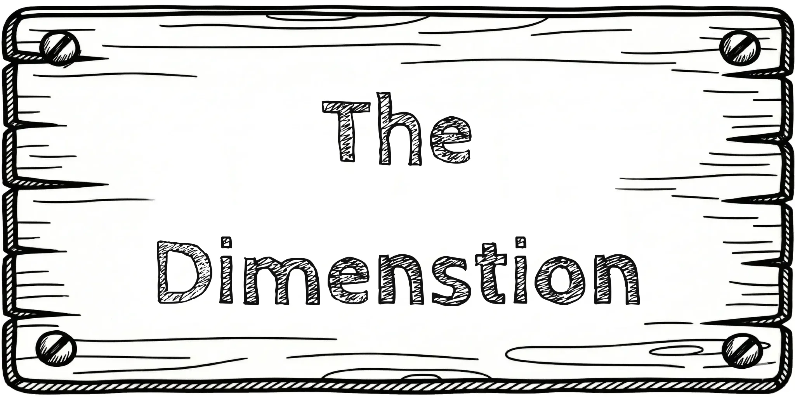

<div align="center">
  

  <h1>🖋️ The Drawn Dimension</h1>
  <p><strong>An Immersive 3D Spatial Portfolio by Sunil Yogi</strong></p>

  <p>
    
    
    
    
    
  </p>

  <p>Welcome to <em>The Drawn Dimension</em> — a unique, interactive portfolio built like a 3D hand-drawn sketchbook. Open doors to different rooms to explore projects, dive into a spatial gallery, learn about my background, and send messages through a virtual bottle in the sea.</p>
</div>

<br />

## 🎨 The Aesthetic

The entire portfolio is built around a cohesive **Monochrome / Hand-Drawn Sketch** aesthetic. 
*   **Custom Fonts:** `CabinSketch` and `RubikScribble` bring the text to life.
*   **Interactive 3D Elements:** Wooden signs, flying sketch text, drawn doors with brush-stroke reveal animations, and floating objects.
*   **Spatial Navigation:** Navigate via 3D corridors and dynamic camera animations powered by GSAP.

## 🚪 The Rooms

1.  🖼️ **The Gallery**  
    A spatial 3D gallery showcasing my selected works in an interactive, explorable space.
2.  💻 **Hardware Stuffs**  
    A behind-the-scenes look into my workspace with stylized, sketched 3D devices (monitors, phones).
3.  ☁️ **About (Infinite Sky)**  
    Fly through an infinite cloudy sky passing through milestones of my life, career, and standout projects (Green Bow, Wretched, Career Guidance).
4.  🌊 **Contact (Message in a Bottle)**  
    An immersive contact form where you write a letter and throw it into the sea! Or, click on the floating barrels to visit my LinkedIn, Discord, Instagram, and Email.

## 🛠️ Technical Stack

*   **Frontend Framework:** React 19 + Vite
*   **3D Engine:** Three.js
*   **React Wrapper:** React Three Fiber (`@react-three/fiber`) & Drei (`@react-three/drei`)
*   **Animations:** GSAP (GreenSock Animation Platform) for buttery-smooth camera movements and timeline sequences.
*   **Post-Processing:** `@react-three/postprocessing` for visual polish.

## 🚀 Running Locally

To experience the drawn dimension on your local machine:

```bash
# 1. Clone the repository
git clone https://github.com/Sunil56224972/The-Drawn-Dimenstion.git

# 2. Navigate to the directory
cd The-Drawn-Dimenstion

# 3. Install dependencies
npm install

# 4. Start the development server
npm run dev
```

Visit `http://localhost:5173` in your browser.

## 📬 Connect With Me

*   **Email:** sunilnathyogi008@gmail.com
*   **Discord:** [Sunil Aimbot](https://discord.com/users/1012816654532620328)
*   **LinkedIn:** [Sunil Yogi](https://www.linkedin.com/in/sunil-aimbot-81340839a)
*   **Instagram:** [@kali_linux_user_](https://www.instagram.com/kali_linux_user_/)

---
<div align="center">
  <p><i>"Code is poetry, and the browser is the canvas."</i></p>
  <p><b>Designed and Developed by Sunil Yogi</b></p>
</div>
